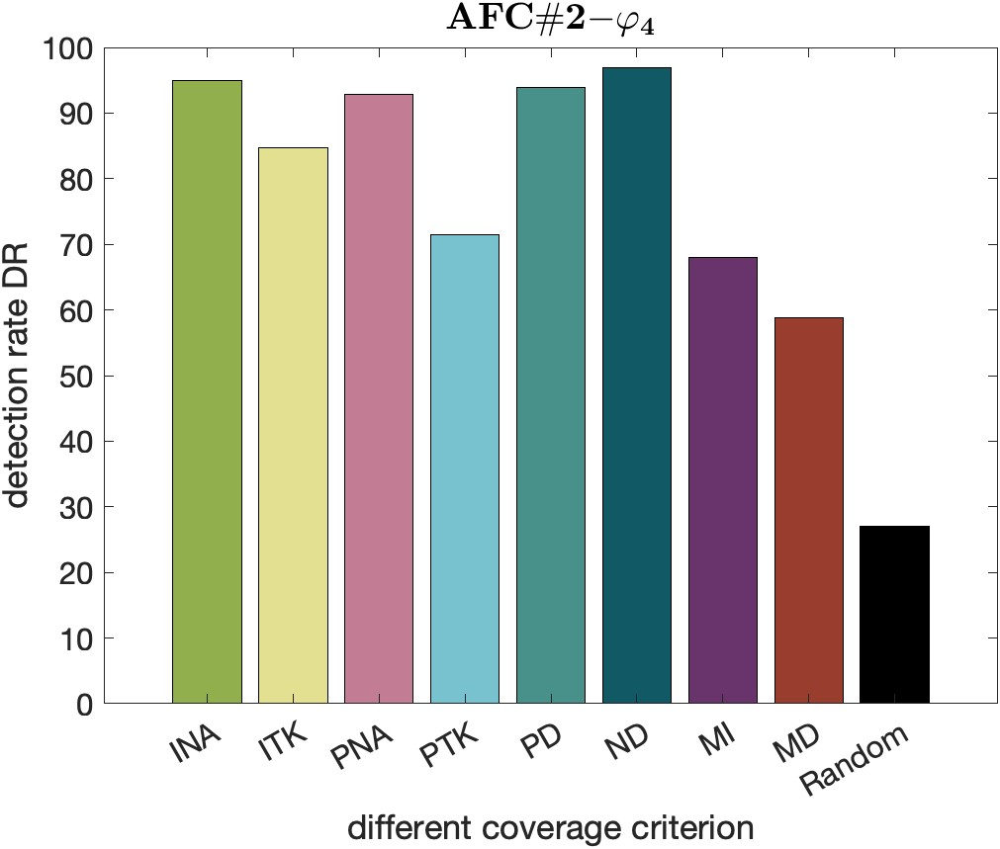
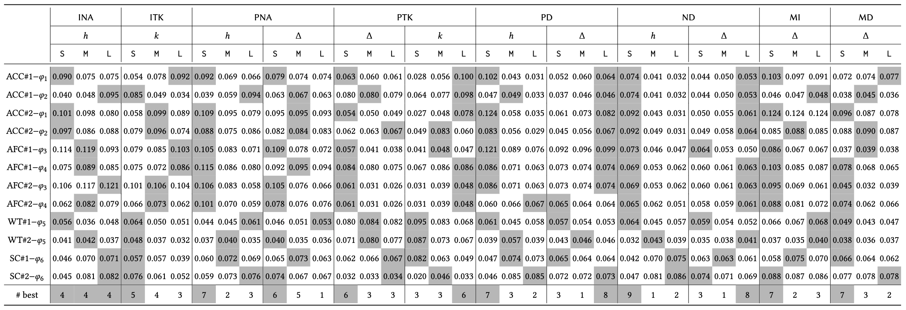
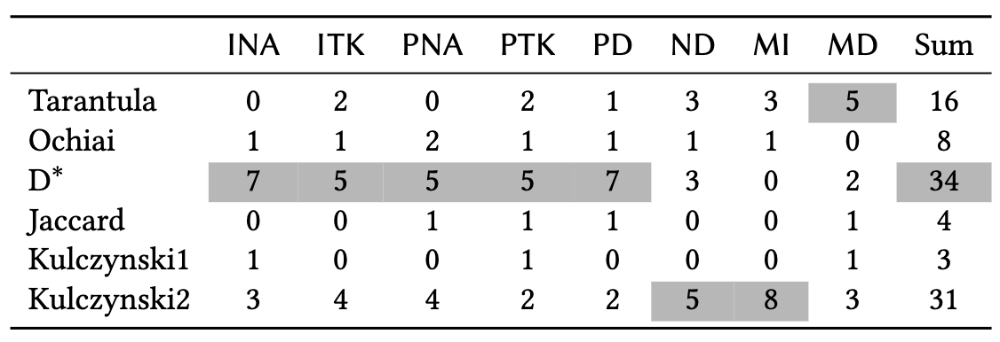

# TACTICAL

This repository reports the code and the benchmarks for the paper "Fault Localization of AI-Enabled Cyber-Physical Systems by Exploiting Temporal Neuron Activation", submitted to ICSE 2025.

## Abstract:

Modern *cyber-physical systems (CPS)* are evolving to integrate *deep neural networks (DNNs)* as controllers, leading to the emergence of *AI-enabled CPSs*. Despite its advantages, an inadequately trained DNN controller may produce incorrect control actions, exposing the system to huge safety risks. Therefore, it is crucial to localize the faulty neurons of the DNN controller that are responsible for the wrong decisions; these neurons can be later fixed, for example, by automated repair. However, since an unsafe system behavior typically arises from a sequence of control actions, establishing a connection between unsafe behaviors and faulty neurons is extremely challenging. To address this problem, we propose TACTICAL that localizes faults in an AI-enabled CPS by exploiting *temporal neuron activation criteria* that capture temporal aspects of the DNN controller inferences. Specifically, based on the executions of test cases, for each neuron, TACTICAL constructs a *spectrum*, which considers the specification satisfaction and the evolution of the activation status of the neuron during the system execution. Then, starting from the spectra of all the neurons, TACTICAL applies suspiciousness metrics to compute a suspiciousness score for each neuron, from which the most suspicious ones are selected. We experimentally evaluate TACTICAL configured with eight *temporal neuron activation criteria*, on 3860 faulty AI-enabled CPS benchmarks spanning over different domains. The results show the effectiveness of TACTICAL w.r.t. a baseline approach. Moreover, the experiments assess the influence of the different temporal neuron activation criteria, hyperparameters, and suspiciousness metrics on the effectiveness of TACTICAL.

<div align=center></div>

## System requirement
- Operating system: Linux or MacOS;
- Matlab (Simulink/Stateflow) version: >= 2020a. (Matlab license needed)
- Python version: >= 3.3
- MATLAB toolboxes dependency: 
  1. [Simulink](https://www.mathworks.com/products/simulink.html)
  2. [Deep Learning Toolbox](https://www.mathworks.com/products/deep-learning.html) 

## Installation

- Install [Breach](https://github.com/decyphir/breach)
  1. start matlab, set up a C/C++ compiler using the command `mex -setup`. (Refer to [here](https://www.mathworks.com/help/matlab/matlabexternal/changing-default-compiler.html) for more details.)
  2. navigate to `breach/` in Matlab commandline, and run `InstallBreach`

## Usage

How to reproduce the experimental results

### Mutation Process
- The user-specified configuration files are stored under the directory `test/config/`. Replace the paths of `TACTICAL` in user-specified file under the line `addpath 1` with their own path. Users can also specify other configurations, such as bugset budget.
- Navigate to the directory `test/`. Run the command `python valFL.py config/[benchmark]/[configfile]`.
- Now the executable scripts have been generated under the directory `test/scripts/`.
- Users need to edit the executable scripts permission using the command `chmod -R 777 scripts/*`.
- Users need to run the script by using the command `./scripts/[scriptname]`. After mutation processed, mutation results data are stored in the `result/`.

### RQs
- After all benchmarks mutation processed, open the `src/RQ1part1.m` by using matlab. Users can change the path of data or the auto mode into manual mode, and run the analyzing progress. First, set `automode=1` in the `src/RQ1part1.m` file and run the analysis. All temporary data files are in the `result/[benchmarkdataname]/transDataProcessed`.
- After completing the previous step of analysis, open `src/RQ2.m`, set the selected metric and run it. The running results will be saved in the `result/RQ2Data_[metric name].mat` file. After reading this file, manually fill in the data in the `RQ2percentage.xlsx` file to obtain the results of RQ2 in the paper, and then select the best set of parameters for each benchmark.
- Use the parameters selected in the previous step to manually set and run in the `src/RQ1part1.m` file, set `automode=0`, and obtain the results of each benchmark in the paper RQ1.1 in `result/[benchmarkdataname]/transDataProcessed/[configs]_topkAnalyze`. Rename the `.mat` files in the directory to the same name as the benchmark and put them in one directory, e.g. `ACC_4_10_spec1.mat`. Run the `src/RQ1part2_RQ3.m` file to get the results of RQ1.2 and RQ3.

## Repository Structure

```
.
├── README.md
├── RQ2percentage.xlsx
├── benchmarks
│        ├── ACC
│        ├── AFC
│        ├── SC
│        └── WT
├── figs
│        ├── RQ1
│        │   ├── RQ1_Dstar
│        │   ├── RQ1_Jaccard
│        │   ├── RQ1_Ochiai
│        │   ├── RQ1_Tarantula
│        │   ├── RQ1_allmetallsps_20p
│        │   ├── RQ1_bar
│        │   ├── RQ1_ku1
│        │   └── RQ1_ku2
│        ├── RQ2
│        ├── RQ3
│        ├── comparetoRandBar.m
│        ├── valRate.m
│        └── workflow.png
├── result
├── src
│        ├── CovFL.m
│        ├── RQ1part1.m
│        ├── RQ1part2_RQ3.m
│        ├── RQ2.m
│        ├── covcriteria
│        │   ├── MDNC.m
│        │   ├── MINC.m
│        │   ├── NC.m
│        │   ├── NDNC.m
│        │   ├── PDNC.m
│        │   ├── TPKNC.m
│        │   ├── TTK.m
│        │   └── TimedNC.m
│        ├── func
│        │   ├── autoSelect.m
│        │   ├── bugGenerator.m
│        │   ├── diffTopkAnalyze.m
│        │   ├── insertWeightBug.m
│        │   ├── nnresultEval.m
│        │   ├── parallelAnalyzeDiffParam.m
│        │   ├── parsaveFLinfo.m
│        │   ├── parsaveMutInfo.m
│        │   ├── plotTopkAnalyze.m
│        │   ├── processBestData.m
│        │   ├── randFL.m
│        │   ├── readFileName.m
│        │   ├── sigMatch.m
│        │   ├── spsCalculator.m
│        │   ├── spsScoreCompute.m
│        │   ├── spstopkAnalyze.m
│        │   └── transData.m
│        └── util
│            ├── neuronPlot.m
│            └── ratePlotBar.m
└── test
    ├── FL.py
    ├── config
    │        ├── ACC
    │        │   ├── ACC_mut_3_15
    │        │   └── ACC_mut_4_10
    │        ├── AFC
    │        │   ├── AFC_mut_3_15
    │        │   └── AFC_mut_4_15
    │        ├── SC
    │        │   ├── SC_mut_4_10
    │        │   └── SC_mut_4_15
    │        └── WT
    │            ├── WT_mut_3_15
    │            └── WT_mut_3_5
    └── valFL.py
```


## Extended experimental results

### RQ1: Does Tactical effectively localize the faulty neurons in an AI-enabled CPS?

This RQ aims to explore whether the TACTICAL method can successfully capture neurons with errors. Here is a supplementary histogram comparing this method with the random method to more intuitively display the effect. Under each different benchmark, a set of parameters most suitable for this application scenario are used for comparison, tops uses the top 20% number of neurons. Consistent with the paper, D* is used as the metric. If you need to get the code for the following histogram, you can get it by running the `figs/comparetoRandBar.m` file. 

#### RQ1 Discussion

- It can be seen from the figure below that under the conditions of the first 20% of screening, this method has great advantages over random in most cases, which illustrates the effectiveness of the method on the other hand. 

- In some cases, particularly in the benchmark of AFC#2_phi3, the expected results were not achieved satisfactorily. Specifically, concerning the identification of faulty neurons, the criteria employed by PTK and MD still demonstrated suboptimal performance, with recognition rates approaching randomness. Through experimentation, it was observed that this discrepancy arose from the utilization of different neural network controllers in various benchmarks, each exhibiting distinct output characteristics. During the output process, these characteristics did not entirely align with the behavioral features defined by each criterion. 

- Future research endeavors will focus on exploring more effective criteria based on these diverse output characteristics, aiming to pinpoint error occurrences and enhance the ability of criteria to better elucidate the behavioral patterns of AI controllers, improve the accuracy of fault localization.

<center class="half">


</center>

<center class="half">



</center>

<center class="half">


</center>

According to the description in RQ3 of the paper, "We also observe that Kulczynski2 and D* exhibit the best performance, as both of them outperform other metrics in at least 50% of the cases." Due to paper space limitations, only results of the D* metric in RQs are displayed, we also want to display results of Kulczynski2，hereinafter referred to as "Ku2". The following are the RQ1 results of Ku2.

<center class="half">


</center>

<center class="half">


</center>

<center class="half">


</center>


Due to the excessive amount of content associated with presenting the results for RQ1 under all suspiciousness metrics, only the results for Kulczynski2 are supplemented here. The analysis results for the remaining metrics can be found in the directory `figs\RQ1`. Here, additional analyses are provided for the top 20% conditions, showcasing results for each distinct benchmark under all metrics. The table results for this analysis can be obtained by executing the provided file `figs/valRate.m`.

- From this table, it is evident that, in specific benchmarks, the selection of the suspiciousness metric is a crucial hyperparameter. A well-chosen metric can significantly enhance the accuracy of fault localization. For instance, in the benchmark AFC#2_spec4, the difference in identification accuracy under the same criterion INA between the best-performing metrics, D* and Ku2, and the comparatively poorer performance of Tarantula approaches approximately 30%. Conversely, for different benchmarks, the choice of an appropriate criterion for analysis is equally pivotal. In AFC#2_spec3, using D* as an example, the difference in performance between the best and worst, ranging from INA to MD, can even approach 50%. These data affirm the second point mentioned in the RQ1 Discussion. The paper extensively discusses how to select appropriate parameters based on different benchmarks and explores the selection of metrics and criteria in detail in RQ2. Additionally, future work will delve into the reasons behind these phenomena and seek more optimal solutions.

<div align=center></div>

### RQ2: How does the selection of hyperparameters of the neuron activation criteria affect the effectiveness of Tactical?

This research question (RQ) meticulously elucidates the impact of parameter selection on experimental outcomes and provides users with comprehensive guidance for parameter selection. Similar to RQ1, the experimental results for all metrics employed in the paper, excluding D*, are supplemented here.

#### RQ2 Discussion
- It was demonstrated in RQ3 that the best metrics are D* and Ku2, through the comparison between the best metrics D* and Ku2, we can find the difference between them is not very big, and both can help users accurately locate errors and obtain better results. The assertion put forth in the paper, stating that 'there is no single value that is consistently better than the others for all the benchmarks,' is validated across all metrics here. Each benchmark necessitates the establishment of either strict or lenient parameters based on the specific application context to achieve optimal recognition outcomes. However, the distinctions in the optimal parameter settings for different metrics are marginal.
  
  - **Note**: While there may not be significant differences in optimal parameter selection, the results from RQ1 indicate that there can be substantial variations in the accuracy of analysis outcomes. Users are advised to refer to the data provided in RQ2 to select the appropriate metric and criterion for application) 

- In other words, the impact of the stringency of parameter selection for a specific benchmark is minimal with respect to different metrics, and is predominantly determined by the nature of the AI controller and the application scenario. If you intend to utilize other metrics for fault localization, it is recommended to consider the parameter selection insights provided in the paper, specifically the result analysis conducted for the D* metric. The findings for D* can serve as a valuable reference for parameter selection when applying alternative metrics in fault localization.

#### Tarantula
<div align=center></div>

#### Ochiai
<div align=center></div>

#### Dstar
<div align=center></div>

#### Jaccard
<div align=center></div>

#### Kulczynski1
<div align=center></div>

#### Kulczynski2
<div align=center></div>

Here, we supplement the parameter statistics under the D* metric based on the results of all benchmark experiments, omitting the majority of data in the RQ2 table for user readability. Users are encouraged to initially refer to this table for parameter selection during usage. Subsequently, for a more comprehensive understanding tailored to users' specific needs and diverse benchmarks, detailed data tables above can be consulted for additional information.</br> 
In the table, the first entry in the row corresponding to the INA parameter is 4/12, indicating that using a small threshold for fault localization across 12 benchmarks results in optimal performance in 4 of them.

<div align=center></div>


### RQ3: How does the selection of suspiciousness metric affect the effectiveness of Tactical?

- The paper presents a comparative analysis among different metrics, and here, an alternative perspective is provided. Across 12 distinct benchmarks, the occurrences of optimal performance for each criterion under a specific metric are observed. For instance, in the table below, the first row and the eighth column indicate that Tarantula under the metric MD achieved better performance in 5 benchmarks compared to other metrics. The table is presented below, and both this table and the one provided in Research Question 3 (RQ3) in the paper reveal that the metrics D* and Ku2 exhibit superior performance.

- This table presents a discrepancy compared to the table showcased in RQ3 of the paper. From this table, it appears that Tarantula is not the worst-performing metric in this approach; in fact, it demonstrates relatively good performance. Simultaneously, Jaccard, Ochiai, and Kulczynski1 exhibit suboptimal performance. However, it's important to note that this table only accounts for extreme cases of optimal performance and does not consider the overall comprehensive performance of metrics across all benchmarks. The table provided in RQ3 integrates the average performance across all benchmarks, offering a more objective assessment of strengths and weaknesses.

  - For instance, Ochiai achieves the best performance in a limited number of cases but boasts excellent overall performance when considering all benchmarks. Consequently, it secures the second-best overall performance. Tarantula attains the best performance more frequently but exhibits suboptimal performance in the majority of benchmarks, as reflected in the data table from RQ1.

<div align=center></div>

