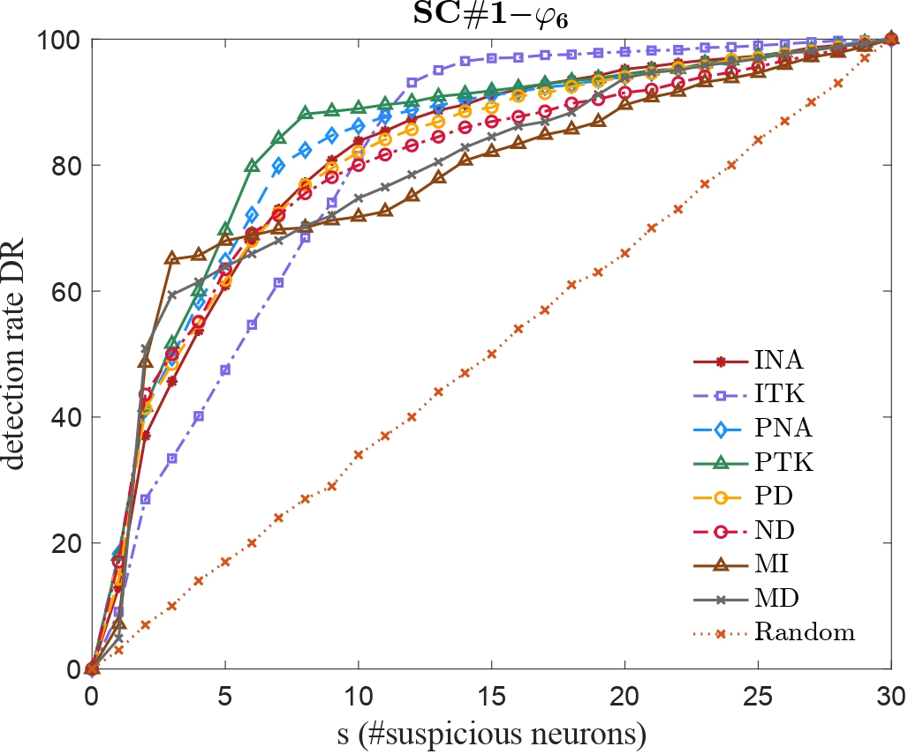
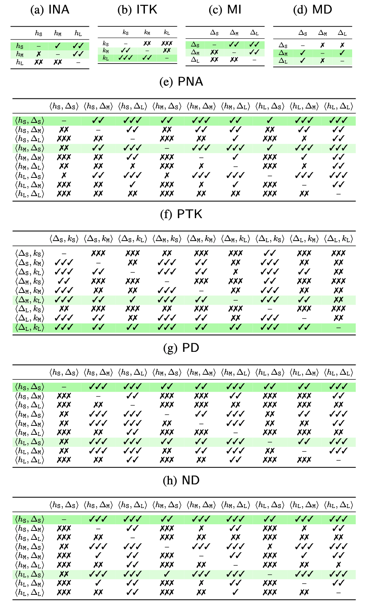

# TACTICAL

This repository reports the code and the benchmarks for the paper "Fault Localization of AI-Enabled Cyber-Physical Systems by Exploiting Temporal Neuron Activation", submitted to ICSE 2025.

## Abstract:
<div style="text-align: justify">
Modern *cyber-physical systems (CPS)* are evolving to integrate *deep neural networks (DNNs)* as controllers, leading to the emergence of *AI-enabled CPSs*. Despite its advantages, an inadequately trained DNN controller may produce incorrect control actions, exposing the system to huge safety risks. Therefore, it is crucial to localize the faulty neurons of the DNN controller that are responsible for the wrong decisions; these neurons can be later fixed, for example, by automated repair. However, since an unsafe system behavior typically arises from a sequence of control actions, establishing a connection between unsafe behaviors and faulty neurons is extremely challenging. To address this problem, we propose TACTICAL that localizes faults in an AI-enabled CPS by exploiting *temporal neuron activation criteria* that capture temporal aspects of the DNN controller inferences. Specifically, based on the executions of test cases, for each neuron, TACTICAL constructs a *spectrum*, which considers the specification satisfaction and the evolution of the activation status of the neuron during the system execution. Then, starting from the spectra of all the neurons, TACTICAL applies suspiciousness metrics to compute a suspiciousness score for each neuron, from which the most suspicious ones are selected. We experimentally evaluate TACTICAL configured with eight *temporal neuron activation criteria*, on 3860 faulty AI-enabled CPS benchmarks spanning over different domains. The results show the effectiveness of TACTICAL w.r.t. a baseline approach. Moreover, the experiments assess the influence of the different temporal neuron activation criteria, hyperparameters, and suspiciousness metrics on the effectiveness of TACTICAL.
</div>

<div align=center></div>

## System requirement
- Operating system: Linux or MacOS;
- Matlab (Simulink/Stateflow) version: >= 2020a. (Matlab license needed)
- Python version: >= 3.3
- MATLAB toolboxes dependency: 
  1. [Simulink](https://www.mathworks.com/products/simulink.html)
  2. [Deep Learning Toolbox](https://www.mathworks.com/products/deep-learning.html) 

## Installation

- Install [Breach](https://github.com/decyphir/breach)
  1. start matlab, set up a C/C++ compiler using the command `mex -setup`. (Refer to [here](https://www.mathworks.com/help/matlab/matlabexternal/changing-default-compiler.html) for more details.)
  2. navigate to `breach/` in Matlab commandline, and run `InstallBreach`

## Usage

How to reproduce the experimental results

### Mutation Process
- The user-specified configuration files are stored under the directory `test/config/`. Replace the paths of `TACTICAL` in user-specified file under the line `addpath 1` with their own path. Users can also specify other configurations, such as bugset budget.
- Navigate to the directory `test/`. Run the command `python valFL.py config/[benchmark]/[configfile]`.
- Now the executable scripts have been generated under the directory `test/scripts/`.
- Users need to edit the executable scripts permission using the command `chmod -R 777 scripts/*`.
- Users need to run the script by using the command `./scripts/[scriptname]`. After mutation processed, mutation results data are stored in the `result/`.

### RQs
- After all benchmarks mutation processed, open the `src/preprocess.m` by using matlab. Users can change the path of data or the auto mode into manual mode, and run the analyzing progress. First, set `automode=1` in the `src/preprocess.m` file and run the analysis. All temporary data files are in the `[dataFolder]/[benchmarkdataname]/transDataProcessed`.

- Open `src/mutantCombination.m`, set the selected metric and run it. All temporary data files are in the `result/multiMutants/[benchmarkdataname]/transDataProcessed`.

- After completing the previous step of analysis, run `src/RQs.m`. The running results will be saved in the `result/multiMutants/RQ2Data/AllRQsResult.mat` file. After reading this file, manually fill in the data in the `RQ2percentage.xlsx` file to obtain the results of RQ1 to RQ4 in the paper, and then select the best set of parameters for each benchmark.

## Repository Structure

```
.
├── README.md
├── RQ2percentage.xlsx
├── benchmarks
│     ├── ACC
│     ├── AFC
│     ├── SC
│     └── WT
├── figs
│     ├── RQ1
│     ├── RQ2
│     ├── RQ3
│     ├── RQ4
│     ├── comparetoRandBar.m
│     ├── valRate.m
│     └── workflow.png
├── result
├── src
│     ├── CovFL.m
│     ├── RQs.m
│     ├── covcriteria
│     │     ├── MDNC.m
│     │     ├── MINC.m
│     │     ├── NC.m
│     │     ├── NDNC.m
│     │     ├── PDNC.m
│     │     ├── TPKNC.m
│     │     ├── TTK.m
│     │     └── TimedNC.m
│     ├── func
│     │     ├── autoSelect.m
│     │     ├── bugGenerator.m
│     │     ├── diffTopkAnalyze.m
│     │     ├── insertWeightBug.m
│     │     ├── nnresultEval.m
│     │     ├── parallelAnalyzeDiffParam.m
│     │     ├── parsaveFLinfo.m
│     │     ├── parsaveMutInfo.m
│     │     ├── plotTopkAnalyze.m
│     │     ├── processBestData.m
│     │     ├── randFL.m
│     │     ├── readFileName.m
│     │     ├── sigMatch.m
│     │     ├── spsCalculator.m
│     │     ├── spsScoreCompute.m
│     │     ├── spstopkAnalyze.m
│     │     └── transData.m
│     ├── func_multi
│     │     ├── autoSelect_multi.m
│     │     ├── diffTopkAnalyze_multi.m
│     │     ├── parallelAnalyzeDiffParam_multi.m
│     │     └── spstopkAnalyze_multi.m
│     ├── mutantCombination.m
│     ├── preprocess.m
│     └── util
│         ├── RQ1part2_RQ3.m
│         ├── neuronPlot.m
│         ├── ratePlotBar.m
│         ├── computeCohen_d.m
│         └── license.txt
└── test
    ├── config
    │     ├── ACC
    │     │     ├── ACC_mut_3_15
    │     │     └── ACC_mut_4_10
    │     ├── AFC
    │     │     ├── AFC_mut_3_15
    │     │     └── AFC_mut_4_15
    │     ├── SC
    │     │     ├── SC_mut_4_10
    │     │     └── SC_mut_4_15
    │     └── WT
    │         ├── WT_mut_3_15
    │         └── WT_mut_3_5
    └── valFL.py
```


## Extended experimental results

## RQ1: Is TACTICAL better than a random localization approach which selects the neurons randomly? 

This RQ assesses whether TACTICAL provides any effective guidance for fault localization, whether the TACTICAL method can successfully capture neurons with errors in other words. Firstly, according to Cohen's d effect size statistical method, among the 48 different methods, only when the threshold of ND is S and the time interval is L does it perform moderately better than the random method. The other 47 methods are significantly superior to random, which indicates the effectiveness of the proposed method in this paper. Additionally, based on Fig. 4 in the paper, we plotted ROC curves for all parameters and different configurations. Furthermore, we supplemented the presentation with example images using Kulczynski2 to illustrate the effectiveness of different benchmarks, hereinafter referred to as "Ku2".

<center class="half">


</center>

<center class="half">


</center>

<center class="half">


</center>

According to the description in RQ4 of the paper, " We observe that Kulczynski2 is the best metric, followed by D*", we also want to display results of D*. The following are the RQ1 results of D*.

<center class="half">


</center>

<center class="half">


</center>

<center class="half">




</center>

Here is a supplementary histogram comparing this method with the random method to more intuitively display the effect. Under each different benchmark, a set of parameters most suitable for this application scenario are used for comparison, tops uses the top 20% number of neurons. Consistent with the paper, D* is used as the metric. If you need to get the code for the following histogram, you can get it by running the `figs/comparetoRandBar.m` file. 

<center class="half">


</center>

<center class="half">


</center>

<center class="half">


</center>

Due to the excessive amount of content associated with presenting the results for RQ1 under all suspiciousness metrics, only the results for Kulczynski2 are supplemented here. The analysis results for the remaining metrics can be found in the directory `figs\RQ1`. Here, additional analyses are provided for the top 20% conditions, showcasing results for each distinct benchmark under all metrics. The table results for this analysis can be obtained by executing the provided file `figs/valRate.m`.

- From this table, it is evident that, in specific benchmarks, the selection of the suspiciousness metric is a crucial hyperparameter. A well-chosen metric can significantly enhance the accuracy of fault localization. For instance, in the benchmark AFC#2_spec4, the difference in identification accuracy under the same criterion INA between the best-performing metrics, D* and Ku2, and the comparatively poorer performance of Tarantula approaches approximately 30%. Conversely, for different benchmarks, the choice of an appropriate criterion for analysis is equally pivotal. In AFC#2_spec3, using D* as an example, the difference in performance between the best and worst, ranging from INA to MD, can even approach 50%. These data affirm the second point mentioned in the RQ1 Discussion. The paper extensively discusses how to select appropriate parameters based on different benchmarks and explores the selection of metrics and criteria in detail in RQ2. Additionally, future work will delve into the reasons behind these phenomena and seek more optimal solutions.

<div align=center></div>


#### RQ1 Discussion

- It can be seen from the figure below that under the conditions of the first 20% of screening, this method has great advantages over random in most cases, which illustrates the effectiveness of the method on the other hand. 

- In some cases, particularly in the benchmark of AFC#2_phi3, the expected results were not achieved satisfactorily. Specifically, concerning the identification of faulty neurons, the criteria employed by PTK and MD still demonstrated suboptimal performance, with recognition rates approaching randomness. Through experimentation, it was observed that this discrepancy arose from the utilization of different neural network controllers in various benchmarks, each exhibiting distinct output characteristics. During the output process, these characteristics did not entirely align with the behavioral features defined by each criterion. 

- Future research endeavors will focus on exploring more effective criteria based on these diverse output characteristics, aiming to pinpoint error occurrences and enhance the ability of criteria to better elucidate the behavioral patterns of AI controllers, improve the accuracy of fault localization.


### RQ2: How does the selection of hyperparameters of the eight temporal neuron activation criteria affect the effective-ness of TACTICAL? 

This RQ identifies the best setting for the hyperparameters of the criteria. In this paper, for RQ2, we consolidate, organize, and analyze fault localization data generated by all six metrics. Utilizing statistical methods, we determine the optimal parameter configurations for each criterion. This approach allows for a better integration of all data, leading to the identification of optimal parameter combinations applicable to a wider range of scenarios (single or multiple faulty benchmarks). However, in practical situations, the selection of metrics should be considered to enhance performance. In the following sections, a demonstration example will be provided for the case of single faulty benchmarks.

The article also presents the results of fault localization obtained after generating data from three faulty benchmarks ("Finally, in a similar way, we produce faulty benchmarks containing three faults (set Fbenchs3), by randomly merging one faulty benchmark from Fbenchs1 and one from Fbenchs2"). Here, we provide additional results of comprehensive analysis obtained from generating data from two faulty benchmarks for comparison.

<div align=center></div>

Given that single faulty benchmark cases are more commonly encountered in practical scenarios, this analysis focuses on such cases, we also prepared the RQ2 data analysis results by manually selecting the optimal parameters. In case a criterion has two hyperparameters hp1 and hp2 , when reporting the values of hp1 , we average across the results of hp2 , and the other way round. Here, the analysis is conducted on individual faulty benchmarks, and the results generated by different metrics are analyzed accordingly. The localization results can vary between single and multiple faulty benchmarks, and the choice between them can be made based on specific requirements or practical needs. Based on the results obtained from RQ4, it is recommended that readers refer to the results of D* and Kulczynski2, as these two metrics exhibit better performance.

#### Tarantula
<div align=center></div>

#### Ochiai
<div align=center></div>

#### Dstar
<div align=center></div>

#### Jaccard
<div align=center></div>

#### Kulczynski2
<div align=center></div>

Here, we supplement the parameter statistics under the D* metric based on the results of all benchmark experiments, omitting the majority of data in the RQ2 table for user readability. Users are encouraged to initially refer to this table for parameter selection during usage. Subsequently, for a more comprehensive understanding tailored to users' specific needs and diverse benchmarks, detailed data tables above can be consulted for additional information.</br> 
In the table, the first entry in the row corresponding to the INA parameter is 4/12, indicating that using a small threshold for fault localization across 12 benchmarks results in optimal performance in 4 of them.

<div align=center></div>

#### RQ2 Discussion

- The data obtained from two faulty benchmarks reveal that, compared to the results presented in the paper, there is not a significant difference in the optimal parameters for TACTICAL. Only PTK exhibits notable changes, where the optimal threshold shifts from S to L. However, for both single and three faulty benchmarks, the optimal results indicate that a threshold of S and a topk value of L provide better localization. MD's optimal parameters vary between M and L, suggesting that the difference in performance between these two parameters for fault localization is minimal. By comparing the results from one to three faulty benchmarks, it is evident that ITK and MD require careful consideration. S performs best for single cases, while using L in multi-case scenarios enables the localization of more faults.

- It was demonstrated in RQ4 that the best metrics are D* and Ku2, through the comparison between the best metrics D* and Ku2, we can find the difference between them is not very big, and both can help users accurately locate errors and obtain better results. 'There is no single value that is consistently better than the others for all the benchmarks' is validated across all metrics here. Each benchmark necessitates the establishment of either strict or lenient parameters based on the specific application context to achieve optimal recognition outcomes. However, the distinctions in the optimal parameter settings for different metrics are marginal.
  
  - **Note**: While there may not be significant differences in optimal parameter selection, the results from RQ1 indicate that there can be substantial variations in the accuracy of analysis outcomes. Users are advised to refer to the data provided in RQ2 to select the appropriate metric and criterion for application) 

- In other words, the impact of the stringency of parameter selection for a specific benchmark is minimal with respect to different metrics, and is predominantly determined by the nature of the AI controller and the application scenario. If you intend to utilize other metrics for fault localization, it is recommended to consider the parameter selection insights provided in the paper, specifically the result analysis conducted for the Ku2 metric. The findings for Ku2 can serve as a valuable reference for parameter selection when applying alternative metrics in fault localization.


### RQ3: How does the used temporal neuron activation criterion Cr affect the effectiveness of TACTICAL? 

This RQ identifies the criterion that provides the best guidance in fault localization. Here are the analysis results for the case of two faulty benchmarks, presented in the table below:
<div align=center></div>

#### RQ3 Discussion

- From the table, it is evident that PNA remains the best-performing criterion. Similarly, upon examining the results for the case of single faulty benchmarks, PNA consistently maintains its superiority, achieving a "medium better" effect compared to all other criteria. It is recommended that users consider using PNA more frequently in practical applications. INA follows closely behind PNA in all scenarios, demonstrating excellent identification performance. Incorporating suitable thresholds to filter faulty benchmarks can lead to improved results, a point that will be further explored and validated through additional experiments in future work.

- On the other hand, PTK and ITK perform poorly, indicating that the output values of neurons do not effectively aid the system in identifying errors compared to the output sizes of other neurons in the same layer. MD also exhibits poor performance, suggesting a certain association with the output patterns of neurons, which will be addressed in subsequent work as it fails to capture distinctive features of erroneous outputs.

### RQ4: How does the selection of the suspiciousness metric SMet affect the effectiveness of TACTICAL?

Here are the analysis results for the case of two faulty benchmarks, presented in the table below. From the table, it can be observed that there is no difference between the results for two and three faulty benchmarks. This indicates that in all experimental conditions, D* and Ku2 demonstrate the best performance.
<div align=center></div>

