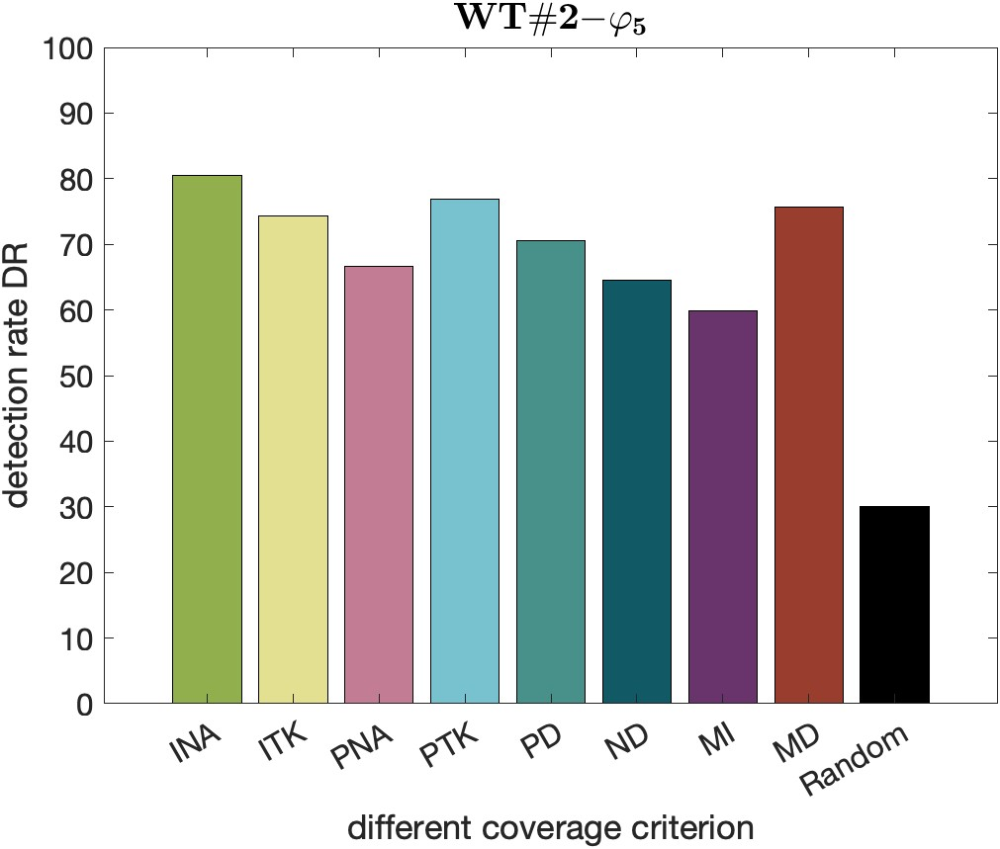
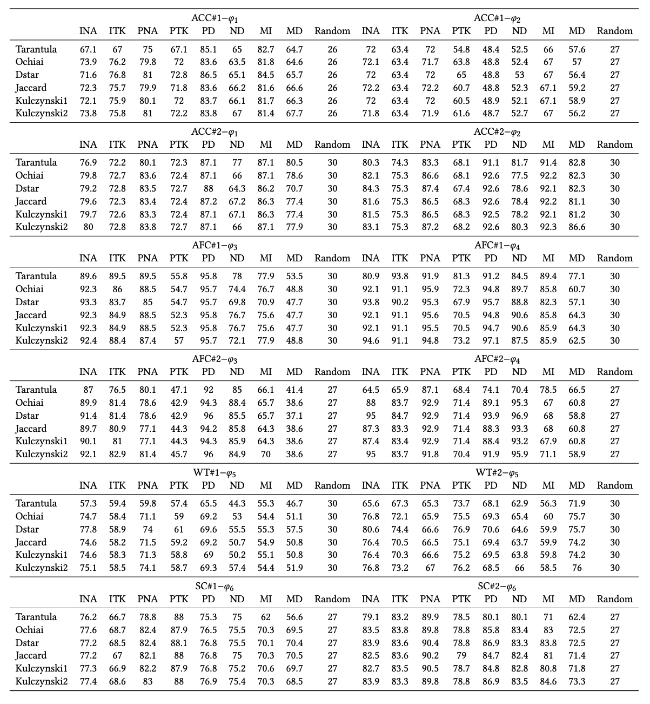

# TACTICAL

This repository reports the code and the benchmarks for the paper "Tactical: Fault Localization of AI-Enabled Cyber-Physical Systems by Exploiting Temporal Neuron Activation".

## Abstract:

Modern cyber-physical systems (CPS) are evolving to integrate deep neural networks (DNNs) as controllers, leading to the emergence of AI-enabled CPSs. However, an inadequately trained DNN controller may produce incorrect control decisions, exposing the systems to huge safety risks. To prevent unsafe behaviors from happening, it is crucial to localize the faulty neurons in DNN controllers, thereby providing valuable references for further system re-engineering. However, since unsafe system behaviors typically arise from a sequence of control decisions, establishing a connection between faulty neurons and unsafe behaviors is extremely challenging. To tackle this problem, we propose TACTICAL that localizes the faults in AI-enabled CPS by exploiting neuron activation criteria that incorporate temporal aspects of DNN controller inferences. Based on the executions of test cases, we construct a spectrum for each neuron, which records the information including the specification satisfaction of each system execution and the activation status of the neuron in the system execution. Having the spectra of all neurons, we apply existing suspiciousness metrics to compute a suspiciousness score for each neuron, by which we select the most suspicious ones. We experimentally evaluate TACTICAL on 12 AI-enabled CPS benchmarks spanning over different domains, by injecting artificial faults into their DNN controllers. The results shows the effectiveness of TACTICAL, based on comparisons with a baseline approach and over different configurations. Moreover, we study the influence of hyperparameters to the effectiveness of TACTICAL, and thereby provide suggestions on hyperparameter selection.

<div align=center></div>

## Folder Structure Conventions

```
.
├── README.md
├── RQ2percentage.xlsx
├── benchmarks
│    ├── ACC
│    │   ├── ACC_4_10
│    │   │    ├── dataset
│    │   │    │   ├── ACC_vl_28_ve_22_spec_1_FFNN_trainlm_10_10_10_10_Nor_Sat_Feb_15_Tr.mat
│    │   │    │   └── ACC_vl_28_ve_22_spec_2_FFNN_trainlm_10_10_10_10_Nor_Sat_Feb_15_Tr.mat
│    │   │    └── model
│    │   │        ├── ACC_FFNN_trainlm_10_10_10_10_Nor_Sat_Feb_15.slx
│    │   │        ├── ACC_FFNN_trainlm_10_10_10_10_Nor_Sat_Feb_15_M.slx
│    │   │        └── config&controller
│    │   │            ├── ACC_FFNN_trainlm_10_10_10_10_Nor_config_Feb_15.mat
│    │   │            └── ACC_FFNN_trainlm_10_10_10_10_Nor_controller_Feb_15.slx
│    │   ├── ACC_vl_28_ve_22_spec_1_FFNN_trainscg_15_15_15_Nor_Sat_Feb_7
│    │   │    └── model
│    │   │        ├── ACC_FFNN_trainscg_15_15_15_Nor_Sat_Feb_7.slx
│    │   │        ├── ACC_FFNN_trainscg_15_15_15_Nor_Sat_Feb_7_M.slx
│    │   │        └── config&controller
│    │   │            ├── ACC_FFNN_trainscg_15_15_15_Nor_config_Feb_7.mat
│    │   │            └── ACC_FFNN_trainscg_15_15_15_Nor_controller_Feb_7.slx
│    │   └── ACCdataset
│    │       ├── ACC_vl_28_ve_22_ddefault_105_spec_1_Orig_Feb_7_Tr.mat
│    │       ├── ACC_vl_28_ve_22_spec_1_FFNN_trainscg_15_15_15_Nor_Sat_Feb_7_Tr.mat
│    │       ├── ACC_vl_28_ve_22_spec_2_FFNN_trainscg_15_15_15_Nor_Sat_Feb_7_Tr.mat
│    │       ├── Nor_ACC_vl_28_ve_22_ddefault_105_spec_1_Orig_Feb_7_Tr.mat
│    │       └── Nor_ACC_vl_28_ve_22_ddefault_20_spec_1_Orig_Feb_7_Tr.mat
│    ├── AFC
│    │   ├── AFC_3_15_TSE
│    │   │    ├── dataset
│    │   │    │   ├── AFC_mu_020_spec_1_FFNN_trainlm_15_15_15_UnNor_May_15_2022_Tr.mat
│    │   │    │   └── AFC_mu_020_spec_2_FFNN_trainlm_15_15_15_UnNor_May_15_2022_Tr.mat
│    │   │    └── model
│    │   │        ├── AFC_FFNN_trainlm_15_15_15_Apr_1_2020.slx
│    │   │        ├── AFC_FFNN_trainlm_15_15_15_Apr_1_2020_M.slx
│    │   │        └── config&controller
│    │   │            └── AFC_FFNN_trainlm_15_15_15_UnNor_config_Apr_1_2020.mat
│    │   └── AFC_4_15_TSE
│    │       ├── dataset
│    │       │    ├── AFC_mu_020_spec_1_FFNN_trainlm_15_15_15_15_UnNor_May_15_2022_Tr.mat
│    │       │    └── AFC_mu_020_spec_2_FFNN_trainlm_15_15_15_15_UnNor_May_15_2022_Tr.mat
│    │       └── model
│    │           ├── AFC_FFNN_trainlm_15_15_15_15_Apr_1_2020.slx
│    │           ├── AFC_FFNN_trainlm_15_15_15_15_Apr_1_2020_M.slx
│    │           └── config&controller
│    │               └── AFC_FFNN_trainlm_15_15_15_15_UnNor_config_Apr_1_2020.mat
│    ├── SC
│    │   ├── SC_FFNN_trainlm_10_10_10_10_Dec_8
│    │   │    ├── dataset
│    │   │    │   └── SC_FFNN_trainlm_10_10_10_10_Dec_8_spec_1_Tr.mat
│    │   │    └── model
│    │   │        ├── SC_FFNN_trainlm_10_10_10_10_Dec_8.slx
│    │   │        ├── SC_FFNN_trainlm_10_10_10_10_Dec_8_M.slx
│    │   │        └── config&controller
│    │   │            ├── SC_FFNN_trainlm_10_10_10_10_config_Dec_8.mat
│    │   │            └── SC_FFNN_trainlm_10_10_10_10_controller_Dec_8.slx
│    │   ├── SC_FFNN_trainlm_15_15_15_15_Dec_8
│    │   │    ├── dataset
│    │   │    │   └── SC_FFNN_trainlm_15_15_15_15_Dec_8_spec_1_Tr.mat
│    │   │    └── model
│    │   │        ├── SC_FFNN_trainlm_15_15_15_15_Dec_8.slx
│    │   │        ├── SC_FFNN_trainlm_15_15_15_15_Dec_8_M.slx
│    │   │        └── config&controller
│    │   │            ├── SC_FFNN_trainlm_15_15_15_15_config_Dec_8.mat
│    │   │            └── SC_FFNN_trainlm_15_15_15_15_controller_Dec_8.slx
│    │   └── SC_Trad
│    │       ├── dataset
│    │       │    ├── SC_RNN_22_spec_1_Dec_8_Te.mat
│    │       │    └── SC_RNN_22_spec_1_Dec_8_Tr.mat
│    │       └── model
│    │           └── steamcondense_RNN_22.slx
│    └── WT
│        ├── WT_error_086_spec_1_FFNN_trainbfg_15_15_15_Dec_22
│        │   ├── dataset
│        │   │    ├── WT_error_086_spec_1_FFNN_trainbfg_15_15_15_Dec_22_Te.mat
│        │   │    └── WT_error_086_spec_1_FFNN_trainbfg_15_15_15_Dec_22_Tr.mat
│        │   └── model
│        │       ├── WT_FFNN_trainbfg_15_15_15_Dec_22.slx
│        │       ├── WT_FFNN_trainbfg_15_15_15_Dec_22_M.slx
│        │       └── config&controller
│        │           ├── WT_FFNN_trainbfg_15_15_15_config_Dec_22.mat
│        │           └── WT_FFNN_trainbfg_15_15_15_controller_Dec_22.slx
│        └── WT_error_086_spec_1_FFNN_trainbfg_5_5_5_Dec_22
│            ├── dataset
│            │   ├── WT_error_086_spec_1_FFNN_trainbfg_5_5_5_Dec_22_Te.mat
│            │   └── WT_error_086_spec_1_FFNN_trainbfg_5_5_5_Dec_22_Tr.mat
│            └── model
│                ├── WT_FFNN_trainbfg_5_5_5_Dec_22.slx
│                ├── WT_FFNN_trainbfg_5_5_5_Dec_22_M.slx
│                └── config&controller
│                    ├── WT_FFNN_trainbfg_5_5_5_config_Dec_22.mat
│                    └── WT_FFNN_trainbfg_5_5_5_controller_Dec_22.slx
├── breach
├── result
├── src
│    ├── CovFL.m
│    ├── RQ1part1.m
│    ├── RQ1part2_RQ3.m
│    ├── RQ2.m
│    ├── covcriteria
│    │   ├── MDNC.m
│    │   ├── MINC.m
│    │   ├── NC.m
│    │   ├── NDNC.m
│    │   ├── PDNC.m
│    │   ├── TPKNC.m
│    │   ├── TTK.m
│    │   └── TimedNC.m
│    ├── func
│    │   ├── autoSelect.m
│    │   ├── bugGenerator.m
│    │   ├── diffTopkAnalyze.m
│    │   ├── insertWeightBug.m
│    │   ├── nnresultEval.m
│    │   ├── parallelAnalyzeDiffParam.m
│    │   ├── parsaveFLinfo.m
│    │   ├── parsaveMutInfo.m
│    │   ├── plotTopkAnalyze.m
│    │   ├── processBestData.m
│    │   ├── randFL.m
│    │   ├── readFileName.m
│    │   ├── sigMatch.m
│    │   ├── spsCalculator.m
│    │   ├── spsScoreCompute.m
│    │   ├── spstopkAnalyze.m
│    │   └── transData.m
│    └── util
│        ├── neuronPlot.m
│        └── ratePlotBar.m
└── test
    ├── FL.py
    ├── config
    │    ├── ACC
    │    │   ├── ACC_mut_3_15
    │    │   └── ACC_mut_4_10
    │    ├── AFC
    │    │   ├── AFC_mut_3_15
    │    │   └── AFC_mut_4_15
    │    ├── SC
    │    │   ├── SC_mut_4_10
    │    │   └── SC_mut_4_15
    │    └── WT
    │        ├── WT_mut_3_15
    │        └── WT_mut_3_5
    └── valFL.py
```

## System requirement
- Operating system: Linux or MacOS;
- Matlab (Simulink/Stateflow) version: >= 2020a. (Matlab license needed)
- Python version: >= 3.3
- MATLAB toolboxes dependency: 
  1. [Simulink](https://www.mathworks.com/products/simulink.html)
  2. [Deep Learning Toolbox](https://www.mathworks.com/products/deep-learning.html) 

## Installation

- Install [Breach](https://github.com/decyphir/breach)
  1. start matlab, set up a C/C++ compiler using the command `mex -setup`. (Refer to [here](https://www.mathworks.com/help/matlab/matlabexternal/changing-default-compiler.html) for more details.)
  2. navigate to `breach/` in Matlab commandline, and run `InstallBreach`

## Usage

How to reproduce the experimental results

### Mutation Process
- The user-specified configuration files are stored under the directory `test/config/`. Replace the paths of `TACTICAL` in user-specified file under the line `addpath 1` with their own path. Users can also specify other configurations, such as bugset budget.
- Navigate to the directory `test/`. Run the command `python valFL.py config/[benchmark]/[configfile]`.
- Now the executable scripts have been generated under the directory `test/scripts/`.
- Users need to edit the executable scripts permission using the command `chmod -R 777 scripts/*`.
- Users need to run the script by using the command `./scripts/[scriptname]`. After mutation processed, mutation results data are stored in the `result/`.

### RQs
- After all benchmarks mutation processed, open the `src/RQ1part1.m` by using matlab. Users can change the path of data or the auto mode into manual mode, and run the analyzing progress. First, set `automode=1` in the `src/RQ1part1.m` file and run the analysis. All temporary data files are in the `result/[benchmarkdataname]/transDataProcessed`.
- After completing the previous step of analysis, open `src/RQ2.m`, set the selected metric and run it. The running results will be saved in the `result/RQ2Data_[metric name].mat` file. After reading this file, manually fill in the data in the `RQ2percentage.xlsx` file to obtain the results of RQ2 in the paper, and then select the best set of parameters for each benchmark.
- Use the parameters selected in the previous step to manually set and run in the `src/RQ1part1.m` file, set `automode=0`, and obtain the results of each benchmark in the paper RQ1.1 in `result/[benchmarkdataname]/transDataProcessed/[configs]_topkAnalyze`. Rename the `.mat` files in the directory to the same name as the benchmark and put them in one directory, e.g. `ACC_4_10_spec1.mat`. Run the `src/RQ1part2_RQ3.m` file to get the results of RQ1.2 and RQ3.

## Extended experimental results

### RQ1: Does Tactical effectively localize the faulty neurons in an AI-enabled CPS?

This RQ aims to explore whether the TACTICAL method can successfully capture neurons with errors. Here is a supplementary histogram comparing this method with the random method to more intuitively display the effect. Under each different benchmark, a set of parameters most suitable for this application scenario are used for comparison, tops uses the top 20% number of neurons. Consistent with the paper, D* is used as the metric. If you need to get the code for the following histogram, you can get it by running the `figs/comparetoRandBar.m` file. <br>
It can be seen from the figure that under the conditions of the first 20% of screening, this method has great advantages over random in most cases, which illustrates the effectiveness of the method on the other hand. <br>
In some cases, particularly in the benchmark of AFC#2_phi3, the expected results were not achieved satisfactorily. Specifically, concerning the identification of faulty neurons, the criteria employed by PTK and MD still demonstrated suboptimal performance, with recognition rates approaching randomness. Through experimentation, it was observed that this discrepancy arose from the utilization of different neural network controllers in various benchmarks, each exhibiting distinct output characteristics. During the output process, these characteristics did not entirely align with the behavioral features defined by each criterion. Future research endeavors will focus on exploring more effective criteria based on these diverse output characteristics, aiming to pinpoint error occurrences and enhance the ability of criteria to better elucidate the behavioral patterns of AI controllers, improve the accuracy of fault localization.

<center class="half">


</center>

<center class="half">


</center>

<center class="half">




</center>

According to the description in RQ3 of the paper, "We also observe that Kulczynski2 and D* exhibit the best performance, as both of them outperform other metrics in at least 50% of the cases." Due to paper space limitations, only results of the D* metric in RQs are displayed, we also want to display results of Kulczynski2，hereinafter referred to as "Ku2". The following are the RQ1 results of Ku2.

<center class="half">


</center>

<center class="half">


</center>

<center class="half">


</center>


Due to the excessive amount of content associated with presenting the results for RQ1 under all suspiciousness metrics, only the results for Kulczynski2 are supplemented here. The analysis results for the remaining metrics can be found in the directory `figs\RQ1`. Here, additional analyses are provided for the top 20% conditions, showcasing results for each distinct benchmark under all metrics. The table results for this analysis can be obtained by executing the provided file `figs/valRate.m`.
<div align=center></div>

### RQ2

The following is the result table compiled by RQ2 under Kulczynski2's metric.<br>
It can be seen from these results that the difference between D* and Ku2 is not very big, and both can help users accurately locate errors and obtain better results.

<div align=center></div>