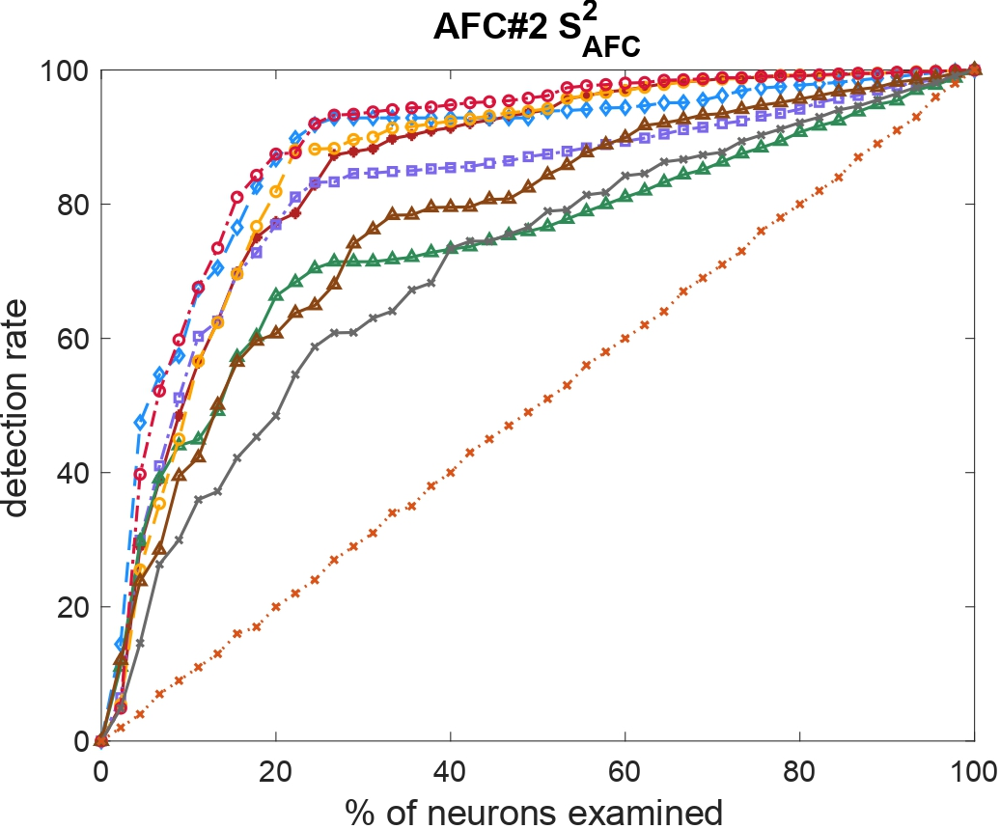

# TACTICAL

This repository reports the code and the benchmarks for the paper "Fault Localization of AI-Enabled Cyber-Physical Systems by Exploiting Temporal Neuron Activation", submitted to ICSE 2025.

## Abstract:

Modern *cyber-physical systems (CPS)* are evolving to integrate *deep neural networks (DNNs)* as controllers, leading to the emergence of *AI-enabled CPSs*. Despite its advantages, an inadequately trained DNN controller may produce incorrect control actions, exposing the system to huge safety risks. Therefore, it is crucial to localize the faulty neurons of the DNN controller that are responsible for the wrong decisions; these neurons can be later fixed, for example, by automated repair. However, since an unsafe system behavior typically arises from a sequence of control actions, establishing a connection between unsafe behaviors and faulty neurons is extremely challenging. To address this problem, we propose TACTICAL that localizes faults in an AI-enabled CPS by exploiting *temporal neuron activation criteria* that capture temporal aspects of the DNN controller inferences. Specifically, based on the executions of test cases, for each neuron, TACTICAL constructs a *spectrum*, which considers the specification satisfaction and the evolution of the activation status of the neuron during the system execution. Then, starting from the spectra of all the neurons, TACTICAL applies suspiciousness metrics to compute a suspiciousness score for each neuron, from which the most suspicious ones are selected. We experimentally evaluate TACTICAL configured with eight *temporal neuron activation criteria*, on 3860 faulty AI-enabled CPS benchmarks spanning over different domains. The results show the effectiveness of TACTICAL w.r.t. a baseline approach. Moreover, the experiments assess the influence of the different temporal neuron activation criteria, hyperparameters, and suspiciousness metrics on the effectiveness of TACTICAL.

<div align=center></div>

## System requirement

- Operating system: Linux or MacOS;
- Matlab (Simulink/Stateflow) version: >= 2020a. (Matlab license needed)
- Python version: >= 3.3
- MATLAB toolboxes dependency: 
  1. [Simulink](https://www.mathworks.com/products/simulink.html)
  2. [Deep Learning Toolbox](https://www.mathworks.com/products/deep-learning.html) 

## Installation

- Install [Breach](https://github.com/decyphir/breach)
  1. start matlab, set up a C/C++ compiler using the command `mex -setup`. (Refer to [here](https://www.mathworks.com/help/matlab/matlabexternal/changing-default-compiler.html) for more details.)
  2. navigate to `breach/` in Matlab commandline, and run `InstallBreach`

## Usage

To reproduce the experimental results, two steps are necessary: the mutation process and addressing research questions (RQs).

### Mutation Process
- The user-specified configuration files are stored under the directory `test/config/`. Replace the paths of `TACTICAL` in user-specified file under the line `addpath 1` with their own path. Users can also specify other configurations, such as bugset and budget.
- Navigate to the directory `test/`. Run the command `python valFL.py config/[benchmark]/[configfile]`.
- Now the executable scripts have been generated under the directory `test/scripts/`.
- Users need to edit the executable scripts permission using the command `chmod -R 777 scripts/*`.
- Users need to run the script by using the command `./scripts/[scriptname]`. After the mutation is performed, mutation results data are stored in the `result/`.

### RQs
- After all benchmarks mutation processed, open the `src/preprocess.m` by using matlab. Users can change the path of data or the auto mode into manual mode, and run the analyzing progress. First, set `automode=1` in the `src/preprocess.m` file and run the analysis. All temporary data files are in the `[dataFolder]/[benchmarkdataname]/transDataProcessed`.

- Open `src/mutantCombination.m`, set the selected metric and run it. All temporary data files are in the `result/multiMutants/[benchmarkdataname]/transDataProcessed`.

- After completing the previous step of analysis, run `src/RQs.m`. The running results will be saved in the `result/multiMutants/RQ2Data/AllRQsResult.mat` file. After reading this file, manually fill in the data in the `RQ2percentage.xlsx` file to obtain the results of RQ1 to RQ4 in the paper, and then select the best set of parameters for each benchmark.

## Repository Structure

```
.
├── README.md
├── RQ2percentage.xlsx
├── benchmarks
│     ├── ACC
│     ├── AFC
│     ├── SC
│     └── WT
├── figs
│     ├── RQ1
│     ├── RQ2
│     ├── RQ3
│     ├── RQ4
│     ├── comparetoRandBar.m
│     ├── valRate.m
│     └── workflow.png
├── result
├── src
│     ├── CovFL.m
│     ├── RQs.m
│     ├── covcriteria
│     │     ├── MDNC.m
│     │     ├── MINC.m
│     │     ├── NC.m
│     │     ├── NDNC.m
│     │     ├── PDNC.m
│     │     ├── TPKNC.m
│     │     ├── TTK.m
│     │     └── TimedNC.m
│     ├── func
│     │     ├── autoSelect.m
│     │     ├── bugGenerator.m
│     │     ├── diffTopkAnalyze.m
│     │     ├── insertWeightBug.m
│     │     ├── nnresultEval.m
│     │     ├── parallelAnalyzeDiffParam.m
│     │     ├── parsaveFLinfo.m
│     │     ├── parsaveMutInfo.m
│     │     ├── plotTopkAnalyze.m
│     │     ├── processBestData.m
│     │     ├── randFL.m
│     │     ├── readFileName.m
│     │     ├── sigMatch.m
│     │     ├── spsCalculator.m
│     │     ├── spsScoreCompute.m
│     │     ├── spstopkAnalyze.m
│     │     └── transData.m
│     ├── func_multi
│     │     ├── autoSelect_multi.m
│     │     ├── diffTopkAnalyze_multi.m
│     │     ├── parallelAnalyzeDiffParam_multi.m
│     │     └── spstopkAnalyze_multi.m
│     ├── mutantCombination.m
│     ├── preprocess.m
│     └── util
│         ├── RQ1part2_RQ3.m
│         ├── neuronPlot.m
│         ├── ratePlotBar.m
│         ├── computeCohen_d.m
│         └── license.txt
└── test
    ├── config
    │     ├── ACC
    │     │     ├── ACC_mut_3_15
    │     │     └── ACC_mut_4_10
    │     ├── AFC
    │     │     ├── AFC_mut_3_15
    │     │     └── AFC_mut_4_15
    │     ├── SC
    │     │     ├── SC_mut_4_10
    │     │     └── SC_mut_4_15
    │     └── WT
    │         ├── WT_mut_3_15
    │         └── WT_mut_3_5
    └── valFL.py
```


## Extended experimental results

## RQ1: Is TACTICAL better than a random localization approach which selects the neurons randomly? 

#### Tarantula
<center class="half">


</center>

<center class="half">


</center>

<center class="half">


</center>


#### Ochiai
<center class="half">


</center>

<center class="half">


</center>

<center class="half">


</center>


#### Dstar
<center class="half">


</center>

<center class="half">


</center>

<center class="half">


</center>


#### Jaccard
<center class="half">


</center>

<center class="half">



</center>

<center class="half">


</center>


#### Kulczynski2
<center class="half">


</center>

<center class="half">


</center>

<center class="half">


</center>


Here is the AUC data for faulty benchmarks ranging from 1 to 3 seperately, with the top-s set to the top 20% of the neural network's neurons

#### Fbench1
<div align=center></div>

#### Fbench2
<div align=center></div>

#### Fbench3
<div align=center></div>


### RQ2: How does the selection of hyperparameters of the eight temporal neuron activation criteria affect the effective-ness of TACTICAL? 


#### Fbench1
<div align=center></div>

#### Fbench2
<div align=center></div>

#### Fbench3
<div align=center></div>


### RQ3: How does the used temporal neuron activation criterion Cr affect the effectiveness of TACTICAL? 


#### Fbench1
<div align=center></div>

#### Fbench2
<div align=center></div>

#### Fbench3
<div align=center></div>


### RQ4: How does the selection of the suspiciousness metric SMet affect the effectiveness of TACTICAL?


#### Fbench1
<div align=center></div>

#### Fbench2
<div align=center></div>

#### Fbench3
<div align=center></div>

